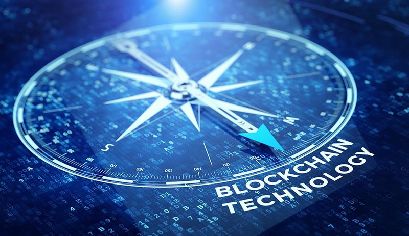

### Why should you take Blockchain course ?

According to the World Economic Forum, 18% of the world's GDP will be on Blockchain related technologies by 2025

### What is it ?

- This is meant for **new software engineers** or those switching from
  other technology to blockchain and architect the use cases.

- This structure will provide you an overall idea of how blockchain works in different platforms. You will learn to setup your own public and private chain and deploy smart contracts in ethereum. 

- Develop/Architect use cases to solve problems using blockchain

###  Course structure
- [Week1](#week1)
- [Week2](#week2)
- [Week3](#week3)

#### Week1

##### Day1 
**Delving into Blockchain**

Topics:
- Introduction to Blockchain
- Why Blockchain is crucial?
- Key vocabulary while discussing Blockchain
- Distinction between databases and blockchain
- Blockchain ecosystem
- Blockchain structure
- Working of Blockchain technology
- Permissioned and permission-less Blockchain

**Hands On:**  
Show how a blockchain works

##### Day2 
**Ethereum**

**Learning Objectives:** In this module, you will learn Ethereum, its ecosystem and develop smart contracts using Solidity programming language.

Topics:
- What is Ethereum?
- What is Ether?
- How to use Ethereum?
- The Ethereum ecosystem, DApps and DAOs
- How Ethereum mining works?
- Learning Solidity
    - Contract classes, functions, and conditionals
    - Inheritance & abstract contracts
    - Libraries
    - Permissioning 
    - Global variables
    - Debugging
    - Future of Ethereum

#### Week2
**Setting up a private and public blockhain environment using ethereum** 

**Learning Objectives:** In this module, you will learn about public and private Blockchain. You will be able to setup your private Blockchain environment. Also, you will be developing a smart contract on Ethereum and will be deploying it on web and console.

##### Day3
Topics:
- Configure and setup a public Blockchain environment 
- Various Blockchain setup platforms
- Steps to build a Blockchain solution
- Smart Contracts on Ethereum
- Compile, deploy and instantiate contracts
- Configuring, running and working with the go-Ethereum client
- How to interact with a contract once deployed
- Account management and mining
- Understand the different stages of building a end to end application 

**Hands On:**
- Installing Ethereum software
- Setting up servers
- Creating Blockchain environment
- Transfer of Ether
- Tracking information using hash
- Viewing Information about blocks in Blockchain
- Deploying contract from web and console

##### Day4
Topics:
- Configure and setup a public Blockchain environment 
- Make transactions between nodes
- Using Ethereum to setup private Blockchain
- Configuring, running and working with the go-Ethereum client
- Discussing the need of creating a private blockchain

**Hands On:**
- Setting up nodes
- Creating Blockchain environment
- Transfer of Ether
- Viewing Information about blocks in Blockchain
- Developing smart contract on private Blockchain
- Deploying contract from web and console

#### Week3
**Other Blockchain Platforms**

**Learning Objectives:** In this module, you will learn about other blockchain platforms  to develop an enterprise-grade applications. You will be taught which platform to choose based on the scenario.

##### Day5
Topics:
- Public vs Private Networks
- Consensus algorithm in different platforms 
- How Blockhain is implemented in CORDA
- How Blockhain is implemented in Hyperledger
- Scalability, usability and interoporability
- Advantages and disadvantages in various platforms

**Hands on:**
- Demo on a application on Corda/ Hyperledger 

##### Day6
Topics:
- Design an application on corda
- Decide the number of nodes, and roles for each nodes
- Develop a poc on with 3 nodes
- Make transactions and interact with the nodes
- Run nodes in different enviroment 

**Hands on:**
- Build a POC on CORDA.

#### Week4
**Other Private Blockhain Platforms**
**Learning Objectives:** In this module, you will understand how Blockchain is shaping economy of tomorrow. Discussions on various use-cases of Blockchain will clear the missing segment of the picture.

##### Day7
Topics:
- How Blockchain is helping our world
- Blockchain transforming business and professions
- Discussing practical use-cases of Blockchain
- How can we bring Aadhaar Card system onto Blockchain?
- How Blockchain can be used to remove corruption
- Real case scenarios of Blockchain
- Blockchain in Banking System
- Blockchain in Land Registry
- Blockchain in Capital Market
- Use cases for government

